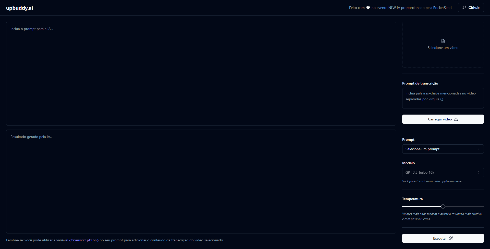

## UpBuddy

### Sobre este projeto | About this project
Pt | Br

Recentemente desenvolvi este projeto Fullstack que utiliza de inteligência artificial, no qual recebe o vídeo enviado e gera transcrições, resumos, títulos, descrições, entre outras muitas coisas, através da API da OpenAI!
Se trata de um projeto com um layout simples, mas cheio de funcionalidades, que integra uma das tecnologias mais promissoras da atualidade, que vem crescendo a cada dia, a inteligência artificial.

Eng

I recently developed a Fullstack project that uses artificial intelligence, in which it receives the sent video and generates transcriptions, summaries, titles, descriptions, among many other things, through the OpenAI API!
It is a project with a simple layout, but full of functionalities, which integrates one of the most promising technologies today, which is growing every day, the artificial intelligence.

### 📡 Tecnologias | Technologys 
Front-end: HTML | CSS | Javascript | React | Vite | TypeScript | Tawilndcss | RadixUi | Shadcn/ui | Lucide React | ffmpeg.wasm | Axios

Back-end: Node.js | Fastify | Prisma | TypeScript | Fastify-multipart | Zod | Openai API | Vercel AI SDK

### ✉️ Contate-me | Contact me 
matheusmaiabastos@hotmail.com
